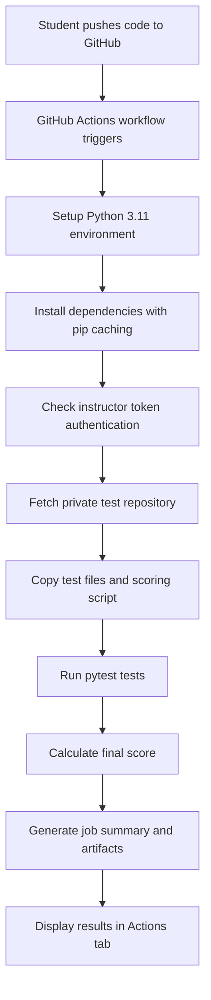

# CI/CD Auto-Grading Guide

## 📋 Overview

This project uses **GitHub Actions** for automated testing and grading. Every time you push code to the `main` or `develop` branches, an automated workflow runs your code against private instructor tests and provides immediate feedback.

---

## 🔄 How Auto-Grading Works

### What Happens When You Push Code?



### Step-by-Step Process

1. **Code Push Detection**
   - Workflow triggers on push to `main` or `develop` branches
   - Also triggers on pull requests to these branches
   - Can be manually triggered via the Actions tab

2. **Environment Setup**
   - Runs on Ubuntu Linux (latest version)
   - Installs Python 3.11
   - Caches pip dependencies for faster subsequent runs

3. **Dependency Installation**
   - Installs all packages from `requirements.txt`
   - First run: ~30-60 seconds
   - Cached runs: ~5-10 seconds (much faster!)

4. **Authentication Check**
   - Verifies instructor has configured the `INSTRUCTOR_TESTS_TOKEN` secret
   - If not configured: workflow fails with student-friendly message
   - This is normal during initial setup (24-48 hours)

5. **Test Retrieval**
   - Clones private instructor test repository: `CS3030-master/project3-instructor-tests`
   - Copies test files to `./tests/` directory
   - Copies `calculate_score.py` grading script
   - **You never see these files** - they remain private

6. **Test Execution**
   - Runs all test files using pytest
   - Generates detailed output with verbose formatting
   - Creates JUnit XML report for GitHub integration
   - Tests continue even if some fail (`continue-on-error: true`)

7. **Score Calculation**
   - Runs `calculate_score.py` to compute your grade
   - Analyzes test results and applies rubric
   - Generates detailed score breakdown

8. **Results Display**
   - Creates formatted summary in GitHub Actions UI
   - Uploads test results, scores, and logs as downloadable artifacts
   - Artifacts retained for 30 days

---

## 📊 Viewing Your Results

### Method 1: GitHub Actions Tab (Recommended)

1. Navigate to your repository on GitHub
2. Click the **"Actions"** tab at the top
3. Find your latest workflow run (named after your commit message)
4. Click on the workflow run to see details

**What You'll See:**
- ✅ Green checkmark = All tests passed
- ❌ Red X = Some tests failed
- 🟡 Yellow dot = Workflow is running

### Method 2: Job Summary

Inside each workflow run:
1. Scroll down to the **"Summary"** section
2. View the auto-generated summary containing:
   - **Test Execution Results**: Last 20 lines of pytest output
   - **Final Score**: Detailed breakdown of points earned
   - Workflow run number and commit SHA

**Example Summary:**
```
📊 Auto-Grading Results

Test Execution
============================ test session starts =============================
platform linux -- Python 3.11.7, pytest-7.4.0
collected 25 items

tests/test_config.py ........                                          [ 32%]
tests/test_parser.py ......                                            [ 56%]
tests/test_metrics.py .....                                            [ 76%]
tests/test_anomalies.py ....                                           [ 92%]
tests/test_integration.py ..                                           [100%]

======================= 25 passed in 2.34s ===============================

Final Score
Total Score: 135/150 (90%)

Breakdown:
- Part 1 (Config Loader): 15/15 ✓
- Part 2 (Data Parser): 18/20 ✗
- Part 3 (Metrics): 20/20 ✓
- Part 4 (Anomalies): 18/20 ✗
- Part 5 (Reports): 20/20 ✓
- Part 6 (Main/CLI): 15/15 ✓
- Exception Handling: 15/15 ✓
- Git Workflow: 14/15 ✗
```

### Method 3: Downloadable Artifacts

1. In the workflow run page, scroll to bottom
2. Find **"Artifacts"** section
3. Download `test-results-{run-number}.zip`
4. Extract to view:
   - `pytest-output.txt`: Complete test output
   - `score-output.txt`: Full score breakdown
   - `test-results.xml`: JUnit XML format

---

## 🎯 Understanding Test Output

### Pytest Markers

```
tests/test_config.py::test_load_valid_config PASSED                [ 4%]
tests/test_config.py::test_load_missing_file FAILED                [ 8%]
tests/test_config.py::test_load_invalid_json PASSED                [12%]
```

**Reading the Output:**
- `PASSED` (`.`): Test passed ✓
- `FAILED` (`F`): Test failed - review your implementation ✗
- `test_load_valid_config`: Function being tested
- `[4%]`: Progress through test suite

### Common Test Failures

1. **FileNotFoundError**
   - Your code isn't handling missing files
   - Add proper `try-except` blocks

2. **AssertionError**
   - Your function's output doesn't match expected result
   - Check function logic and return values

3. **TypeError**
   - Wrong data type returned
   - Verify function signatures match requirements

4. **AttributeError**
   - Missing required attribute or method
   - Ensure all required functions are implemented

---

## 🚀 Optimization Features

### Pip Caching

**How It Works:**
- First workflow run: Downloads and installs all dependencies (~45 seconds)
- Subsequent runs: Restores cached dependencies (~5 seconds)
- Cache is invalidated if `requirements.txt` changes

**Benefits:**
- Faster feedback on code changes
- Reduced GitHub Actions minutes usage
- More efficient CI/CD pipeline

**Cache Key:**
```yaml
cache: 'pip'
cache-dependency-path: 'requirements.txt'
```

### Artifact Upload

**What Gets Saved:**
- `pytest-output.txt`: Full test execution log
- `score-output.txt`: Complete grading breakdown
- `test-results.xml`: JUnit XML for test reporting

**Retention:**
- Artifacts kept for **30 days**
- Download anytime to review past results
- Useful for comparing improvements over time

---

## 🔒 Security & Privacy

### Private Test Repository

**Why Tests Are Private:**
- Prevents students from hardcoding solutions
- Ensures academic integrity
- Mirrors real-world proprietary testing scenarios

**How It's Secured:**
- Tests stored in: `CS3030-master/project3-instructor-tests`
- Access requires `INSTRUCTOR_TESTS_TOKEN` secret
- Students cannot view or clone this repository
- Tests are copied temporarily during workflow execution only

### Instructor Token

**What It Is:**
- GitHub Personal Access Token (PAT) with repository read access
- Configured by instructor as repository secret
- Students never see or have access to this token

**Setup Timeline:**
- Configured within 24-48 hours of repository creation
- Until configured: workflow shows friendly message
- No action required from students

---

## ⚡ Workflow Triggers

### Automatic Triggers

```yaml
on:
  push:
    branches: 
      - main
      - develop
      - 'feature/**'
  pull_request:
    branches: 
      - main
      - develop
```

**When Workflow Runs:**
- ✅ Push to `main` branch
- ✅ Push to `develop` branch
- ✅ Push to any `feature/*` branch (e.g., `feature/config-loader`)
- ✅ Pull request to `main` or `develop`
- ✅ Manual trigger via Actions tab

**When It DOESN'T Run:**
- ❌ Local commits (not pushed to GitHub)
- ❌ Other branch patterns (e.g., `bugfix/*`, `hotfix/*`)

**Best Practice:**
- Work on feature branches → automatic testing on every push!
- Merge to `develop` for integration testing
- Merge to `main` for final submission

---

## 📝 Workflow Configuration

### File Location
```
.github/
├── workflows/
│   └── autograding.yml       # Main workflow configuration
└── scripts/
    └── check_instructor_token.sh  # Token validation script
```

### Key Configuration Settings

```yaml
runs-on: ubuntu-latest        # OS environment
python-version: '3.11'        # Python version
cache: 'pip'                  # Enable dependency caching
continue-on-error: true       # Don't stop on test failures
retention-days: 30            # Artifact storage duration
```

---

## 🐛 Troubleshooting

### Workflow Fails Immediately

**Problem:** "INSTRUCTOR_TESTS_TOKEN Setup Required"
- **Cause:** Instructor hasn't configured access token yet
- **Solution:** Wait 24-48 hours, continue working on assignment
- **Note:** This is expected during initial setup

### Tests All Fail

**Problem:** All tests fail with import errors
- **Cause:** Missing dependencies or Python version mismatch
- **Solution:** 
  - Verify `requirements.txt` includes all needed packages
  - Ensure you're using Python 3.11 compatible code

### Workflow Doesn't Trigger

**Problem:** Pushed code but no workflow run appears
- **Cause:** Pushed to wrong branch or workflow disabled
- **Solution:**
  - Verify you pushed to `main` or `develop`
  - Check Actions tab isn't disabled in repository settings

### Artifacts Missing

**Problem:** Can't find downloadable test results
- **Cause:** Artifacts expire after 30 days
- **Solution:** 
  - Download artifacts soon after workflow runs
  - Re-run workflow if results expired

---

## 📈 Best Practices

### Development Workflow

```bash
# 1. Create feature branch
git checkout -b feature/config-loader

# 2. Implement and test locally
python ci_health_monitor.py --help
pytest tests/ -v  # If you have tests locally

# 3. Commit regularly
git add .
git commit -m "Implement config loader with error handling"

# 4. Push feature branch to trigger CI/CD testing
git push origin feature/config-loader

# 5. Review results in Actions tab
# - Fixed the code based on test feedback

# 6. Continue working, push again to re-test
git commit -am "Fix JSON parsing error handling"
git push origin feature/config-loader

# 7. When feature is complete, merge to develop
git checkout develop
git merge feature/config-loader
git push origin develop

# 8. Finally merge to main for submission
git checkout main
git merge develop
git push origin main
```

### Testing Strategy

1. **Test Locally First** (if possible)
   - Fastest feedback loop
   - No GitHub Actions minutes consumed
   - But remember: final grade uses instructor tests

2. **Push Feature Branches for Immediate Testing**
   - Every push to `feature/*` triggers automated tests
   - Get feedback quickly without merging
   - Iterate rapidly on your feature branch

3. **Push to Develop Branch**
   - Test integration of multiple features
   - Verify everything works together
   - Multiple attempts encouraged

3. **Final Push to Main**
   - When all tests pass on develop
   - Clean commit history
   - Ready for grading

### Commit Messages

Good commit messages help track progress:
```bash
✅ "Implement config loader with JSON validation"
✅ "Add exception handling for file operations"
✅ "Fix anomaly detection threshold logic"

❌ "Update code"
❌ "Fix stuff"
❌ "WIP"
```

---

## 💡 Tips for Success

### Before First Push

- [ ] Implement at least one complete function
- [ ] Test function locally with sample data
- [ ] Ensure `requirements.txt` is complete
- [ ] Commit to feature branch first

### During Development

- [ ] Push frequently to `develop` for feedback
- [ ] Review test output carefully
- [ ] Download artifacts to see full test details
- [ ] Fix failures incrementally

### Before Final Submission

- [ ] All tests passing on `develop` branch
- [ ] Clean git history with meaningful commits
- [ ] Final push to `main` branch
- [ ] Verify workflow completed successfully
- [ ] Download final artifacts for records

---

## 🎓 Learning Objectives

This CI/CD workflow teaches you:

1. **Continuous Integration**: Automated testing on every code change
2. **GitHub Actions**: Industry-standard CI/CD platform
3. **Test-Driven Development**: Write code to pass existing tests
4. **Git Workflow**: Professional branching and merging strategies
5. **Error Diagnosis**: Reading test output and debugging failures
6. **DevOps Practices**: Real-world automated deployment pipelines

**Career Skills:**
- 95% of tech companies use automated CI/CD
- GitHub Actions used by Microsoft, Google, Netflix, and more
- Essential skill for Software Engineers, DevOps Engineers, and SREs

---

## 📚 Additional Resources

### GitHub Actions Documentation
- [Official GitHub Actions Docs](https://docs.github.com/en/actions)
- [Workflow Syntax](https://docs.github.com/en/actions/using-workflows/workflow-syntax-for-github-actions)
- [Using Python with GitHub Actions](https://docs.github.com/en/actions/automating-builds-and-tests/building-and-testing-python)

### Pytest Documentation
- [Pytest Official Docs](https://docs.pytest.org/)
- [Reading Pytest Output](https://docs.pytest.org/en/stable/how-to/output.html)

### Git Best Practices
- [Git Branching Strategy](https://git-scm.com/book/en/v2/Git-Branching-Branching-Workflows)
- [Writing Good Commit Messages](https://chris.beams.io/posts/git-commit/)

---

## ❓ Questions & Support

**If you encounter issues:**

1. Check the troubleshooting section above
2. Review workflow run logs in Actions tab
3. Download and examine artifacts
4. Post in course discussion forum with:
   - Link to failing workflow run
   - Specific error message
   - What you've tried so far
5. Contact instructor or TA during office hours

**Common Questions:**

**Q: Can I see the test files?**
A: No, tests are private to maintain academic integrity. Focus on implementing requirements from the README.

**Q: Why did my workflow fail with "token not configured"?**
A: The instructor needs to add the access token. This typically happens within 24-48 hours. You can continue working in the meantime.

**Q: How many times can I push and test?**
A: Unlimited! Push as often as needed. Every push to `main`/`develop` triggers testing.

**Q: Why are some tests passing locally but failing in GitHub Actions?**
A: Instructor tests may be more comprehensive or test edge cases. The private tests are the authoritative grading criteria.

**Q: Can I modify the workflow file?**
A: No modifications needed. The workflow is pre-configured for your assignment. Changes may cause grading issues.

---

## 🎯 Success Checklist

Before considering your project complete:

- [ ] Workflow runs without errors on `main` branch
- [ ] All or most tests passing (target: 80%+)
- [ ] Downloaded final artifacts for your records
- [ ] Reviewed job summary shows expected score
- [ ] All required functions implemented
- [ ] Proper exception handling in place
- [ ] Clean git history with descriptive commits
- [ ] No hardcoded values or test-specific logic

**Ready for submission when:**
✅ GitHub Actions shows green checkmark
✅ Score meets or exceeds requirements
✅ All MVP features implemented
✅ Code follows best practices

---

*Last Updated: February 9, 2026*
*Workflow Version: 1.0*
